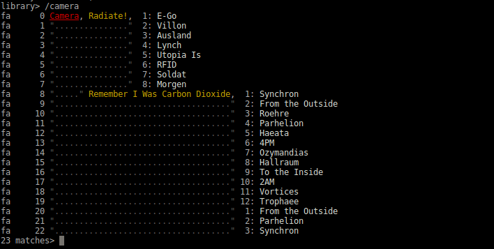

# Shuffletron is a music player based on search and tagging, with a terminal UI, for Linux, written in Common Lisp.


Shuffletron is a text-mode music player oriented around search and
tagging. Its principle of operation is simple: search for songs, then
play them.



# Build

First make the binary for your Lisp:

    make shuffletron-bin  # sbcl
    # make shuffletron-ccl
    # make shuffletron-ccl64

Install the binary and link the libraries:

    sudo make install

Run it via the script:

    ./shuffletron

## Dependencies

On Debian, you first need a Lisp implementation. In doubt, install SBCL:

    apt install sbcl

You need those dependencies for Flac and Ogg support:

     apt install libflac-dev
     apt install libvorbis-dev

Alternatively you could remove the related mixalot packages in the `shuffletron.asd`:

    :depends-on (:osicat :mixalot :mixalot-mp3 :mixalot-vorbis :mixalot-flac)

# Usage

Searches are performed by typing a `/` followed by the search string.

If ID3 tags are present, songs after a search are presented in the following form:

    Artist, [Album,] [Track:] Title

If ID3 information on the artist and title is not available, the
filename is printed instead.

In the  leftmost column is some  subset of the letters  'f', 'a', 'b',
and 't'.   These indicate  which fields matched  the query  string, as
follows:

    f: Filename
    a: Artist
    b: Album
    t: Title

Successive searches refine the result of previous searches, and the
prompt indicates the number of items you're currently searching
within.  If there had been more than 50 matches, they would not be
printed by default, but you could use the `show` command at any time
to print them.

Following this is a column of numbers, starting from zero. These allow
you to choose  songs to play as comma (or  space) delimited numbers or
ranges of numbers. If the song  is already in the queue, the number is
highlighted in bold white text. Here, I decide to play song 8 then 0-3
by entering this at the prompt:

    9 matches> 8, 0-3

The currently  playing song is  interrupted, and the chosen  songs are
added to  the head of the playback  queue. To see the  contents of the
queue, use the 'queue' command:

```
9 matches> queue
     (0)  Chromeo, She's In Control, 10: Ah Oui Comme Ca
     (1)  "........................"  1: My And My Man
     (2)  "........................"  2: Needy Girl
     (3)  "........................"  3: You're So Gangsta
```

Notice that  the prompt changed  from "library>" to  "9 matches>"
after our  initial search. Also note that the `queue` command
doesn't disrupt the  current search results (this is  why numbering in
the  queue listing is  surrounded with  parentheses, to  indicate that
entering numbers for playback does not refer to them).

To  add songs  to the  queue  without interrupting  the current  song,
prefix the song list with `+` (to append) or `pre` (to prepend).

The  queue can be  cleared with  the `clear`  command, and  the `skip`
command skips  the current song and  advances to the next  song in the
queue.  The `next`  command is  similar, but  differs when  looping is
enabled: 'next' retains the current song at the end of the queue so it
will play again, 'skip' does not.

The `loop` command toggles looping  mode. In looping mode, songs are
returned to  the end of  the queue when  they finish playing,  or when
they are bypassed using the 'next' command.

When you've  completed a  search, a single  blank line  moves backward
through the search history, eventually returning to the "library>"
prompt.

If you've  imported a large  library, the ID3  tags may not  have been
scanned.   In this case,  the program  will suggest  that you  run the
scanid3 command.   Scanning ID3  tags can be  very time  consuming, as
each file must be opened  and read from. Once scanned, ID3 information
is remembered by caching  it in the `~/.shuffletron/id3-cache` file, so
you only need to do this the first time you run the program.  ID3 tags
of new files are scanned  automatically when the program starts unless
there are more than 1,000 new files.

Additional help topics:

    help commands
    help examples
    help alarms

# Licence

MIT
